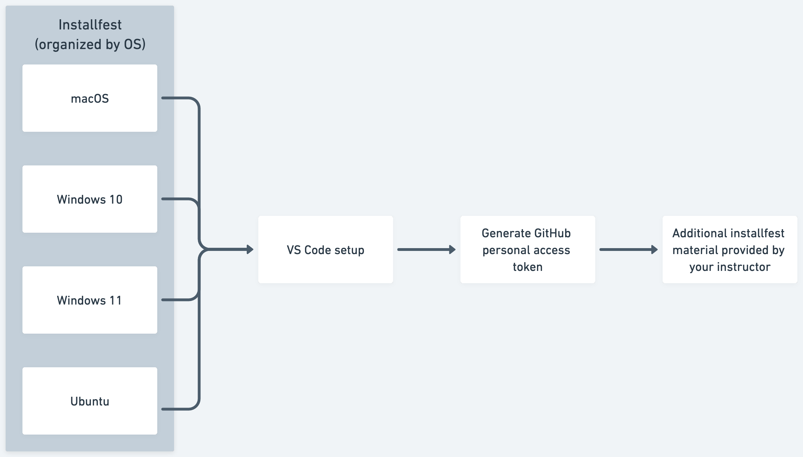

# The Installfest Journey

Installfest can feel stressful at times - you're using applications you're possibly unfamiliar with, running a bunch of commands you don't recognize, hearing terms and vocabulary for the first time, and you may even see errors you don't know how to begin troubleshooting. 

That's all ok though, because setting up and configuring your local development environment is your first real step in your career as a developer! As you're going through installfest and encountering technologies you're unfamiliar with, don't be afraid to research these more and seek deeper understanding. And when you encounter errors, don't forget that your installfest point-of-contact is here to help too!

To help you through this process, we've included this handy guide walking you through the individual steps so that you can at least be sure you're not missing anything along the way. Follow the process outlined below (and shown above) to guide you through this process.

# 1. Installfest

Most installfest content is found within these OS-specific guides that will walk you through a setup process tailored to your OS. Make sure you only follow one path!

- **[macOS](./1.1.1-installfest-mac.md)**
- **[Windows 10](./1.1.1-installfest-windows-10.md)**
- **[Windows 11](./1.1.1-installfest-windows-11.md)**
- **[Ubuntu](./1.1.1-installfest-ubuntu.md)**

## Installed apps

The installfests above will guide you through installing or configuring the following applications, **regardless of your operating system**:

- Slack
- Zoom
- Zsh
- Oh My Zsh
- Visual Studio Code
- Git
- nvm
- Node.js
- nodemon

You'll also set up both GitHub and General Assembly GitHub Enterprise accounts.

### Some installfests include applications specific to one OS, noted below

**macOS**
- Rectangle
- Xcode command line developer tools
- Homebrew

**Windows 10/Windows 11**
- Windows Terminal
- WSL (Ubuntu)
- Visual Studio Code WSL Extension
- PowerToys (optional)

**Ubuntu**
- curl

# 2. VS Code setup

Get VS Code customized for your needs during SEI by following the **[VS Code Setup](https://git.generalassemb.ly/SEI-CC/sei-9-25/blob/main/Unit_1/01-dev-environment/1.1.2-installfest-vs-code.md)** guide.

# 3. Generate a GitHub personal access token

Follow the steps in the [GitHub Personal Access Token walkthrough](./1.1.3-installfest-github-pat.md) so that you're able to interact with GitHub from the command line.

# 4. Additional installfest material provided by your instructor

If you instructor has any tools they would like you to install you'll tackle those last. Those documents will be provided by them directly.

# 5. Celebrate, you're done! 🎉
