# macOS 13 Ventura and macOS 12 Monterey Installfest

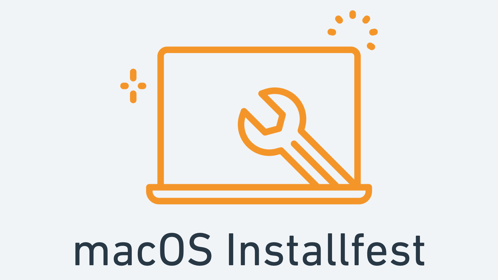

# What you need to begin *(you must read this, do not skip this, this is important)*

- ***A device running macOS 13 Ventura or macOS 12 Monterey.***

  **[This Apple support article](https://support.apple.com/en-us/HT201475)** may be useful in helping you update your machine to one of the OSs.
- At least 20GB of free hard drive space.
- At least 8GB of RAM. 16GB of RAM or more is preferable and will improve your learning experience (particularly when screen sharing in Zoom).
- A user account with administrative privilege to your local installation of macOS.
- A fundamental understanding of macOS system administration and debugging.

# Troubleshooting

If you run into issues during installfest, please reach out to your installfest point of contact.

# Checking your processor type

Check your processor type in macOS by selecting the Apple logo in the top left of your screen and navigating to the **About This Mac** option. Macs with an Apple Silicon processor will have a chip type of Apple, as shown on the left below. Macs with an Intel processor will have a processor type of Intel, shown on the right below. These windows will look slightly different in macOS Monterey, but the same information will be present.

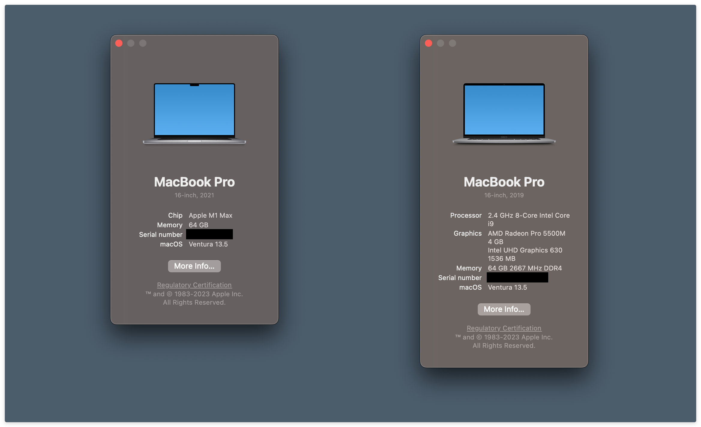

For the purposes of this installfest, it will rarely matter which category you fall into, and when it does matter, it will be explicitly called out (like it is in the next section).

# Running applications built for Intel Macs on Macs equipped with Apple Silicon processors

If you are using a device equipped with an Apple Silicon chip, the first time you run an application that uses Intel-based features, you will see something like the prompt below telling you to install Rosetta. When this happens, select **Install**, and when the installation is complete, relaunch the application.

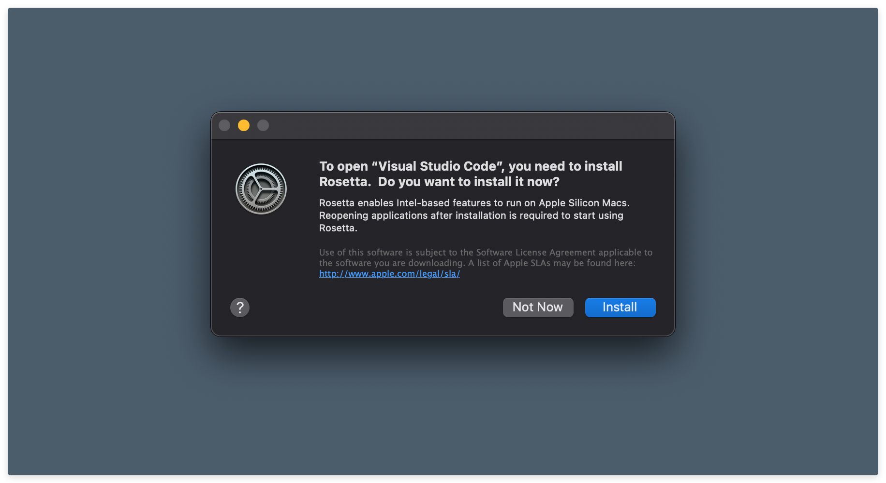

# Rectangle

We highly recommend against using the built-in macOS window management features unless you have extensive experience using them and are already comfortable manipulating windows without a mouse. This is where Rectangle comes in.

Rectangle is an open-source window management tool that offers extensive customization - no more fiddling with window position in macOS! Install Rectangle from **[here](https://rectangleapp.com/)**. Once it is installed by moving it into the **`Applications`** directory, launch it with **Spotlight** (using **`‚åò Command + Space`**). 

Because Rectangle is an application downloaded from the internet, you’ll be prompted to allow it to open after you’ve installed it. Grant this permission.

You'll also be prompted to authorize Rectangle to control your window positions, as shown below. Allow this by clicking the **Open System Preferences** button in the dialog box.

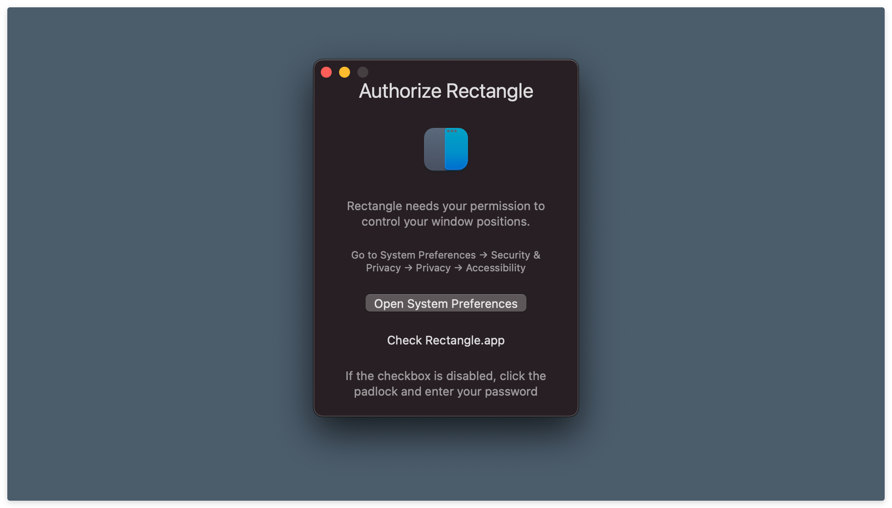

The System Settings app will open and take you to the **Privacy & Security** pane. Turn on the toggle next to the **Rectangle** app. You’ll be prompted to allow the modification of your system settings - do so.

Below, you'll find the Privacy and Security pane after Rectangle has been given the appropriate system permissions.


Immediately after giving Rectangle the appropriate permissions, you will be asked which default shortcuts and behavior you prefer. Opt for the **Recommended** control scheme (the Spectacle scheme conflicts with multiple programs we use in class - that's no good).

Try getting familiar with Rectangle today and the rest of this week. The most useful commands for your use at first will likely be:

- **`⌃ Ctrl + ⌥ Option + ← Left Arrow`** to move windows to the left half of the screen
- **`⌃ Ctrl + ⌥ Option + → Right Arrow`** to move windows to the right half of the screen
- **`⌃ Ctrl + ⌥ Option + ↩ Return`** to maximize windows

This is only the beginning; after you’ve mastered these you can move on to the more advanced commands by exploring the app.

# Slack

We will be using Slack to communicate throughout the course. Download the app **[here](https://slack.com/downloads/)** and install it. Please do not use the in-browser version of Slack, as it makes managing notifications unnecessarily difficult and makes it easy to miss important class information - the app is the way to go.

Because Slack is an application downloaded from the internet, you’ll be prompted to allow it to open after you’ve installed it. Grant this permission.

You will also be prompted to allow access to the Downloads folder. Grant Slack this permission by selecting **OK**.

When macOS prompts you to accept notifications from Slack, as shown below, ensure that you do so. This will allow you to receive message notifications.

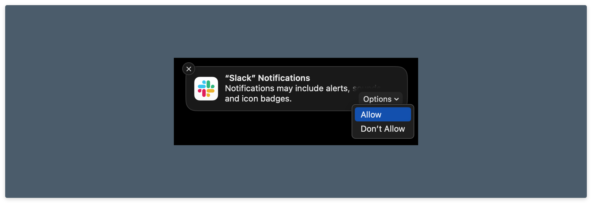

We also recommend downloading the Slack app for your mobile device to stay in touch on the go - you can find quick QR code links inside the toggles below. You won't need this often, but it can be handy in emergencies.

<details>
<summary>Slack - iOS</summary>

Scan this QR code with your iOS device to get the Slack app from the App Store.


</details>

<details>
<summary>Slack - Android (Google Play)</summary>

Scan this QR code with your Android device to get the Slack app from the Google Play Store.


</details>

# Zoom

We'll hold class in Zoom. If you haven't already, download the Zoom client from **[here](https://zoom.us/download#client_4meeting)** and install it. 

If your device uses an Apple Silicon chip, double-check that you have installed the version for Apple Silicon chips highlighted below. This will vastly improve your computer’s performance while running Zoom and is easy to miss at first glance!

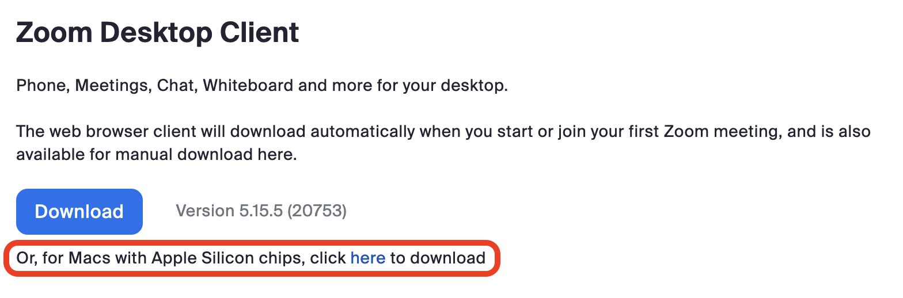

## Zoom permission setup *(don't skip this, even if you have already downloaded and installed Zoom)*

Ensure you complete *all* of the following steps, even if you have already downloaded and installed Zoom so that you can share your screen!

The macOS Zoom client requires certain permissions to access your camera, microphone, and screen - let's enable those now.

After installing it, open the Zoom application and log in to a Zoom account. If you don’t already have one, you’ll need to create an account by clicking the Sign Up link on the Sign In page. 

Upon signing in, you should immediately be prompted to allow access to the microphone. Grant this permission by selecting **OK**. If a prompt didn't appear, that's ok, continue!

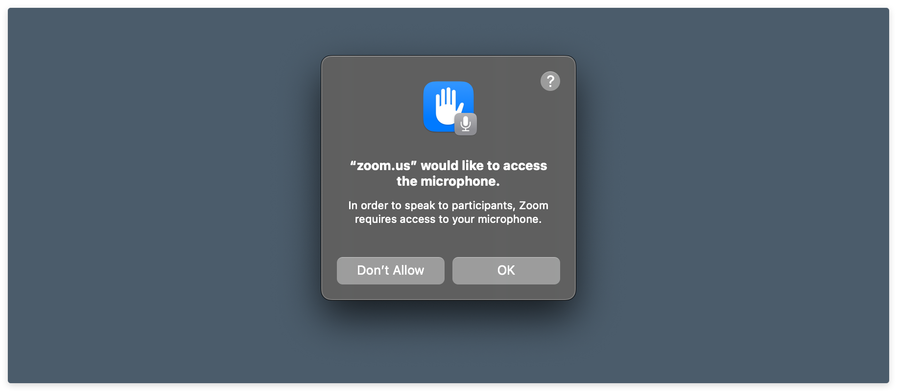

You should then arrive at the main Zoom window. Click on the **New Meeting** button to launch a new meeting with you as the only participant. 

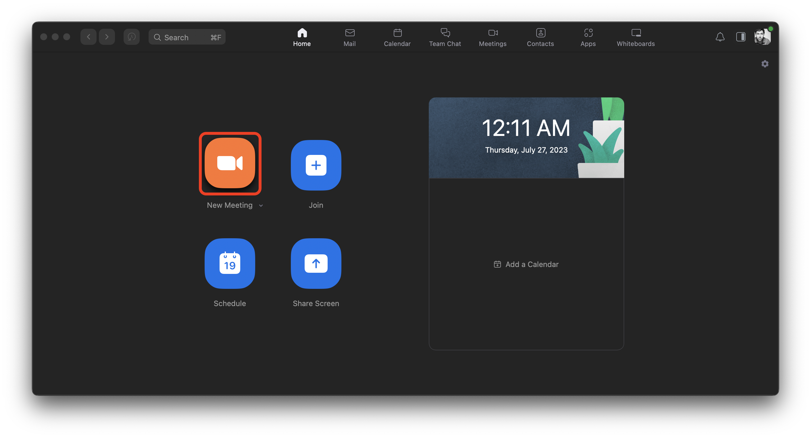

You'll be prompted to allow access to your Mac's camera. Do so by selecting **OK**. If a prompt didn't appear, that's ok, continue!


Next, you’ll likely be asked to join your audio to the Zoom room. Do this. If you’re not prompted to join your audio to the Zoom room, that is ok! 

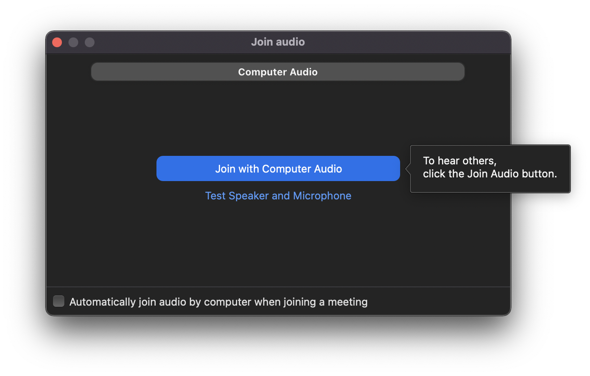

Now, share your screen by clicking the green **Share Screen** button at the bottom of the window.

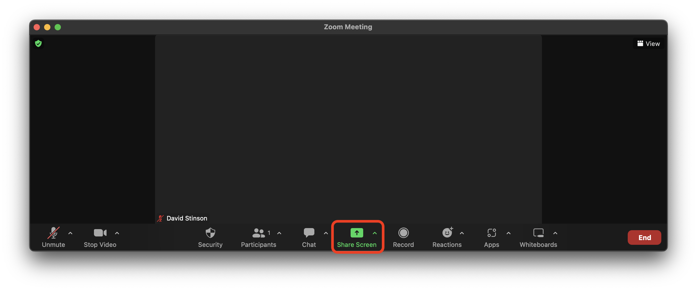

You'll be shown a screen that looks similar to the one below. Select **Desktop 1** and click the **Share** button in the bottom right of the window.

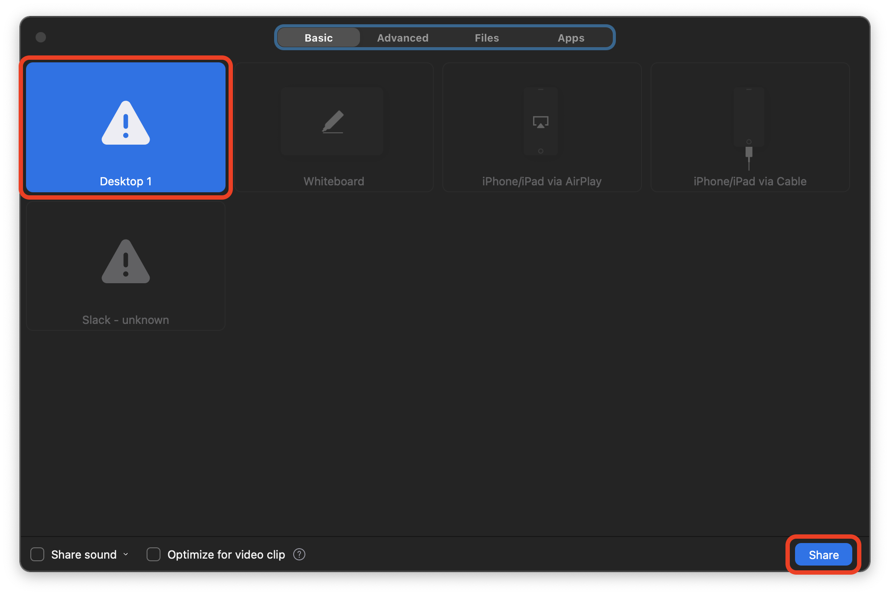

After clicking share, you'll see the below dialog box appear. Select **Open System Preferences**.

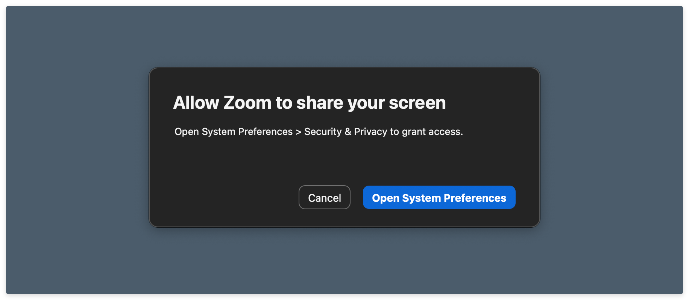

You'll be taken to the **Privacy & Security** pane in the **System Settings** application, as shown below. Turn on the toggle next to the **Zoom** app. You’ll be prompted to allow the modification of your system settings - do so. Immediately after you have given Zoom the appropriate permissions, you will receive a notification saying that Zoom will not be able to record the contents of your screen until it is quit. Select the **Quit & Reopen** option. You'll also be asked to end the current Zoom meeting. Do so.

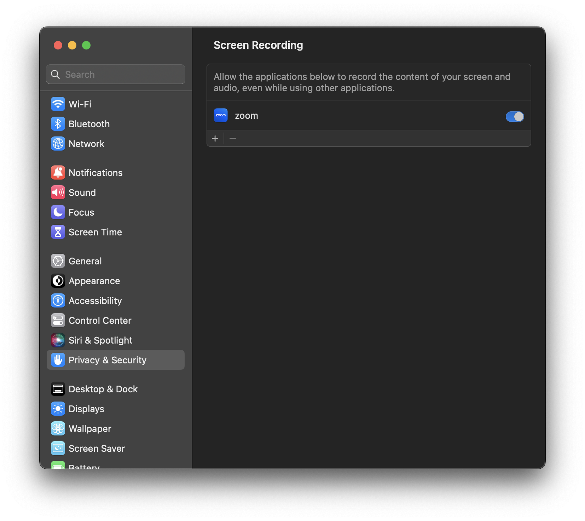

There is no need to re-open the app; you should be good to screen share now!

# A note on copying commands

When possible, ***please copy the commands from this page***. You will use most of the commands here once and never again. Typing them out will only introduce the possibility for you to make errors. Certain commands will require you to alter portions of them - this is specifically called out when they appear. There are no bonus points for doing work already done for you.

## Copying text in code blocks

To copy text from code blocks, use your mouse to hover over the code block. A **Copy** button will appear in the upper right corner. Click this, and the text held in the code block will be put on your clipboard, ready to be pasted.

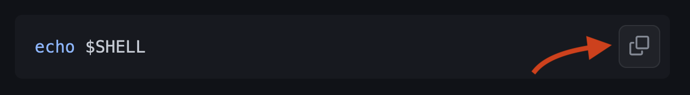

# Zsh

Start by opening the Terminal application. To do so, press **`‚åò Command + Space`** to launch **Spotlight** and type **Terminal**, then select the Terminal application by pressing **`Return`** when it appears. Get used to doing this often; it's the fastest way to start applications on the Mac!

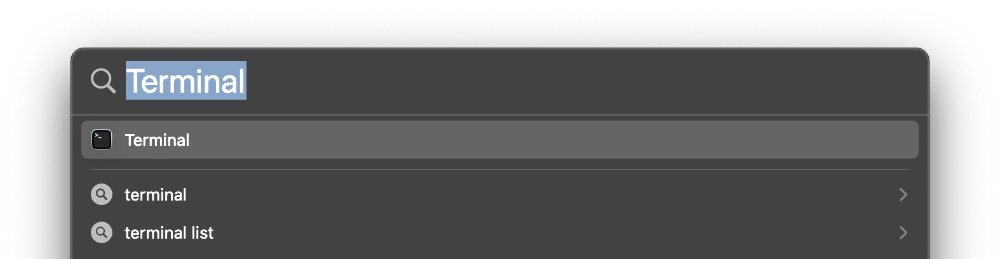

The Terminal application should start! Now that we're here, we can check to see what the default Shell is. The Shell is a program that lets us run commands that the computer can understand in the Terminal app. We will use Zsh as the default shell. Check if Zsh is already your default shell with this command:

```bash
echo $0
```

If this command outputs `-zsh` as shown below, please skip to the **Xcode Command Line Tools** section below.

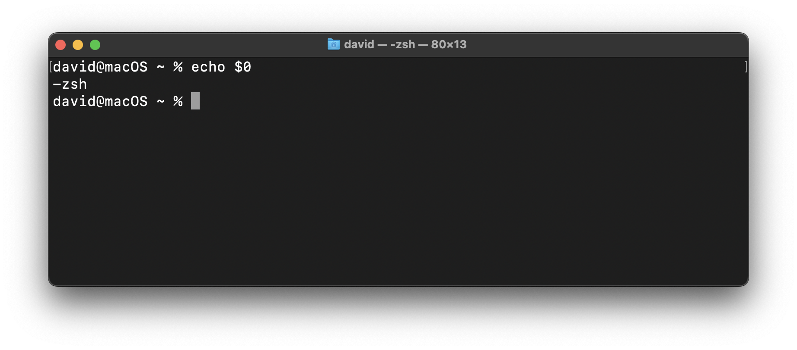

</aside>

## If Zsh is not your Mac's default shell

If the `echo $0` command outputs anything other than `-zsh`, you will need to make Zsh your default shell with this command:

```bash
chsh -s $(which zsh)
```

After you have done that, end your terminal session by closing the terminal window.

Open a new terminal window. You may be prompted to run a configuration setup for new users. If you are, populate the **`~/.zshrc`** with the configuration recommended by the system administrator. 

After doing that, rerun this command:

```bash
echo $0
```

It should now output `-zsh`. If it does not, reach out to your installfest point of contact before continuing.

# Xcode command line developer tools

We do not use Xcode in class, but some other command line applications that we use do require some Xcode libraries. Install them with this command:

```bash
xcode-select --install
```

You should be prompted with the below dialog box. Select **Install**. You must also agree to the Command Line Tools License Agreement when prompted.

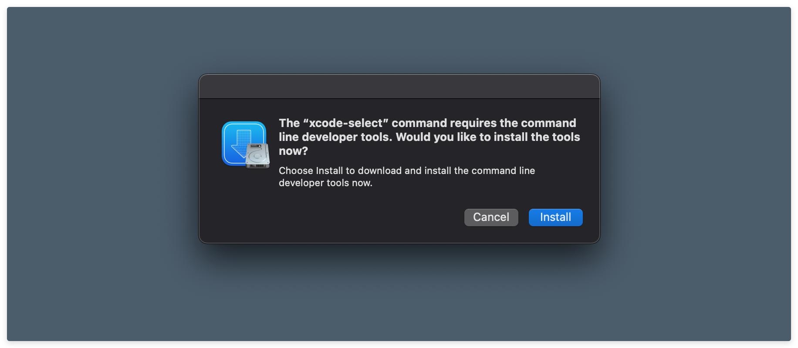

This will begin a large (>1GB) download. Please wait for it to complete before moving on.

Under certain circumstances, you may be prompted to download these tools again, even after you've done this process once. If you are, go ahead and allow it, but if you are continually asked to install these tools, reach out to your installfest point of contact for a solution - fixing this may involve downloading Xcode from the Mac App Store.

# Oh My Zsh

We will also install Oh My Zsh - an open-source, community-driven framework for managing your Zsh configuration. Use this command:

```bash
sh -c "$(curl -fsSL https://raw.githubusercontent.com/ohmyzsh/ohmyzsh/master/tools/install.sh)"
```

Upon successfully installing Oh My Zsh, you should be greeted with the following screen: 

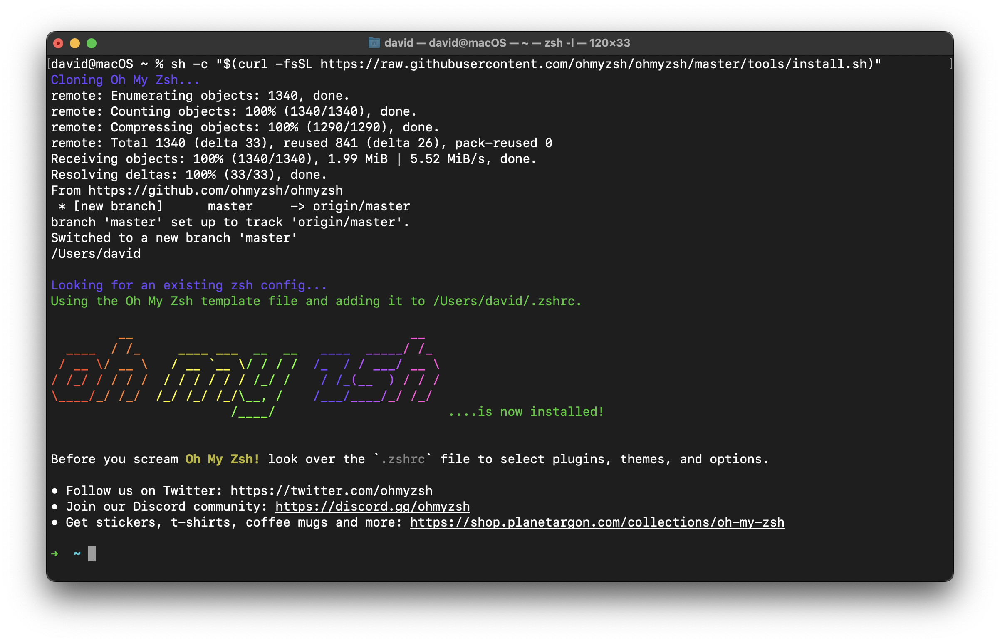

Note that your prompt has now changed to simply be `~`. This is the desired outcome!

# Visual Studio Code

We will use VS Code as our editor in class. Download VS Code [**here**](https://code.visualstudio.com/).

## Moving Visual Studio Code to the Applications directory is *extremely important!*

***Extremely important:*** To ensure you can properly execute code, be sure that **Visual Studio Code** is in your Mac's **`Applications`** directory. ***It will not be placed in the Applications directory by default!*** Open the **Finder** application and navigate to the **`Downloads`** directory. With it open, drag the freshly downloaded **Visual Studio Code** application into the **`Applications`** directory. 

## Install the `code` Command in your PATH

Do not complete this step until you have manually moved the **Visual Studio Code** application to your `Applications` directory!


1. Launch VS Code using spotlight (**`‚åò Command + Space`** - then start typing **Visual Studio Code** until you see the app, then press `‚Ü© Return`). When the app launches, you'll be prompted to confirm the action since you downloaded it from the internet.
2. Type **`‚åò Command  + Shift + P`** to open the command palette.
3. Start typing **shell command**, and when you see the **Shell Command: Install 'code' command in PATH** command, select it! Here's an example of what this will look like:
    
  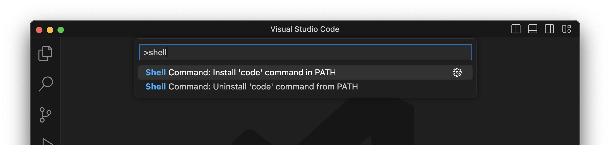
    
4. You may see a dialog box that reads, "Code will now prompt with 'osascript' for Administrator privileges to install the shell command." Select **OK** if you are.
5. You may be prompted to enter your user account password to continue. Do so if you are.
6. You'll be shown: **Shell command 'code' successfully installed in PATH.** Select **OK**.
7. Quit both VS Code and the Terminal application.
8. Relaunch Terminal

Check [**this link**](https://code.visualstudio.com/docs/setup/mac) for troubleshooting if you run into issues.

# Homebrew

Homebrew is a package manager we will use to install various command-line tools in our class. Learn more [**here**](https://brew.sh).

```bash
/bin/bash -c "$(curl -fsSL https://raw.githubusercontent.com/Homebrew/install/HEAD/install.sh)"
```

You will be prompted to enter the user password for your device. Do so. It will not be displayed on the screen in any form as you type it - this is common for command-line password entry. After entering it, you will be prompted to allow the script to install various applications and create multiple directories, as shown in the screenshot below. Press **`‚Ü© Return`** to allow this. 

If you are prompted to install any Xcode tools, say yes.

Note that if you are using a Mac with an Apple Silicon chip, your directory names may differ from those in this screenshot (likely starting with **`/opt/homebrew`**). That's just fine!

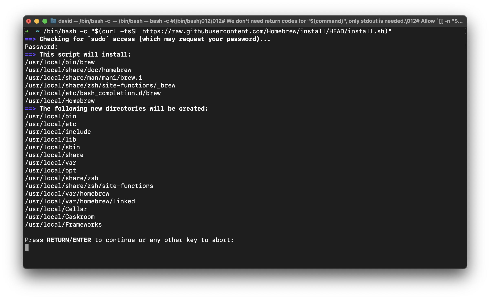

## Next Steps *very important - you're not done yet!*

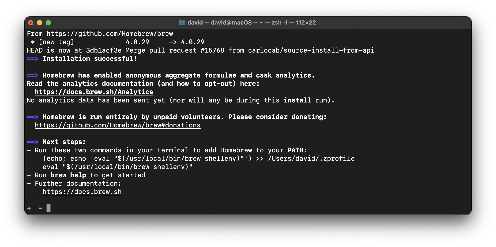

After completing the installation, you will likely be prompted to enter further commands found in the **Next steps** section in your terminal to finalize the installation. ***You must complete the actions in this prompt before proceeding.***

In the above output, we are told to **Run these two commands in your terminal to add Homebrew to your PATH:**

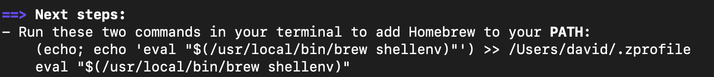

If you have a similar message, you ***must*** run the commands that are displayed in your terminal (feel free to copy and paste them!). **Do not enter the commands shown above. They will not work. You must copy the commands listed in your own terminal and run them.**

If no commands are shown under the next steps, you may continue.

# GitHub (GH)

At its core, GitHub (commonly abbreviated as GH) is a service for hosting Git repositories (which we'll talk about soon) in the cloud, but it also enables developers to collaborate on projects much more effectively. It might help to think of it as a social media platform for you and more than 100 million developers worldwide.

If you don't have an account there, create one now. Visit **[`https://github.com`](https://github.com)** and sign up. While there are paid account tiers, GitHub offers a very generous free tier that offers more than you need for the course.

# GitHub Enterprise (GHE)

In addition to using GitHub, you'll use General Assembly's private GitHub Enterprise instance (commonly abbreviated as GHE) throughout the course. If you think of GitHub as a social media platform for developers worldwide, you can think of GitHub Enterprise as a social media platform just for developers at General Assembly.

You can sign up for an account here: **[http://git-invite.generalassemb.ly/]( http://git-invite.generalassemb.ly/)**

You may use the same username for both GH & GHE accounts; however, it’s recommended that you distinguish between the two by appending **-ga** to your GH username, for example: **YourGitHubUsername-ga**

## What's the difference between GH and GHE? Why does this matter?

It's important to keep in mind that while they are very similar, these are two separate and distinct entities that are fully split and unaware of one another's existence.

You'll do the vast majority of your contributing in public on GitHub, while your course materials, templates, labs, and more will come from GitHub Enterprise to protect General Assembly intellectual property.

# Git

Git is the version control software we will be using - it's an extremely popular tool among developers used to track changes to work (done in repositories) through time. We'll be covering Git much more in-depth later, 

```bash
brew install git
```

## Git Config

With Git installed, we can now make some configuration changes to it so that we can use it more effectively. Complete all of the following configuration steps.

Use the below command to add a user name to Git, which will be used to identify your commits. Replace `User Name` with a name of your choice. Make sure you leave the quotes surrounding your username. Keep the name somewhat professional, or just use your name - this will be used to identify your commits on GitHub. There will not be any output from this command.

```bash
git config --global user.name "User Name"
```

Next, use the below command to add an email to Git, which will be used to identify your commits. Replace `user@email.com` with the email address associated with your **[`https://github.com`](https://github.com)** account (***NOT your GitHub Enterprise account at [`https://git.generalassemb.ly`](https://git.generalassemb.ly)***). **The email you provide MUST match the email address associated with your GitHub account.** Ensure you leave the quotes surrounding your email. There will not be any output from this command. If you don’t have a **[`https://github.com`](https://github.com)** account yet, create one before you run this.

```bash
git config --global user.email "user@email.com"
```

Set the default branch name to `main` with the below command. There will not be any output from this command.

```bash
git config --global init.defaultBranch main
```

Set the default Git editor to VS Code with the below command. There will not be any output from this command.

```bash
git config --global core.editor "code --wait"
```

By default, Git will ask for a new commit message when commits are brought into a Git repo. The following command will force the default commit message for all those commits instead of prompting you to add a commit message. While this isn’t a Git command, we’re still tackling it as part of this section since it changes Git's behavior. There will not be any output from this command.

```bash
echo "export GIT_MERGE_AUTOEDIT=no" >> ~/.zshrc
```

Turn off rebasing as the default behavior when pulling from a repo with the below command. There will not be any output from this command.

```bash
git config --global pull.rebase false
```

## Configuring a Global Git Ignore File

***Note: This step is vital to getting a job after the course. If you do not complete these steps exactly, it will look extremely bad to a future employer when they look over your GitHub repos.***

Proper code, utilities, and the use of Git ignore files prevent us from uploading private secrets to the internet.

A global Git ignore file (**`.gitignore_global`**) will prevent us from uploading private secrets to the internet across all of your projects so that you don't have to worry about making the appropriate entries in every project's Git ignore file.

Use this command to create a **`.gitignore_global`** file in the user directory:

```bash
touch ~/.gitignore_global
```

There will not be any output from this command.

Next, configure Git to use this file:

```bash
git config --global core.excludesfile ~/.gitignore_global
```

Open the new **`.gitignore_global`** file in VS Code:

```bash
code ~/.gitignore_global
```

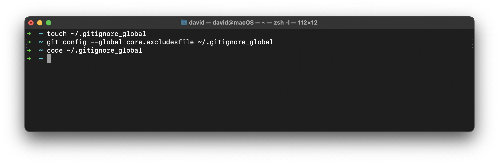

This may be your first time launching VS Code to work with an actual file. If so, congrats! You'll arrive at a page that should look a lot like this:

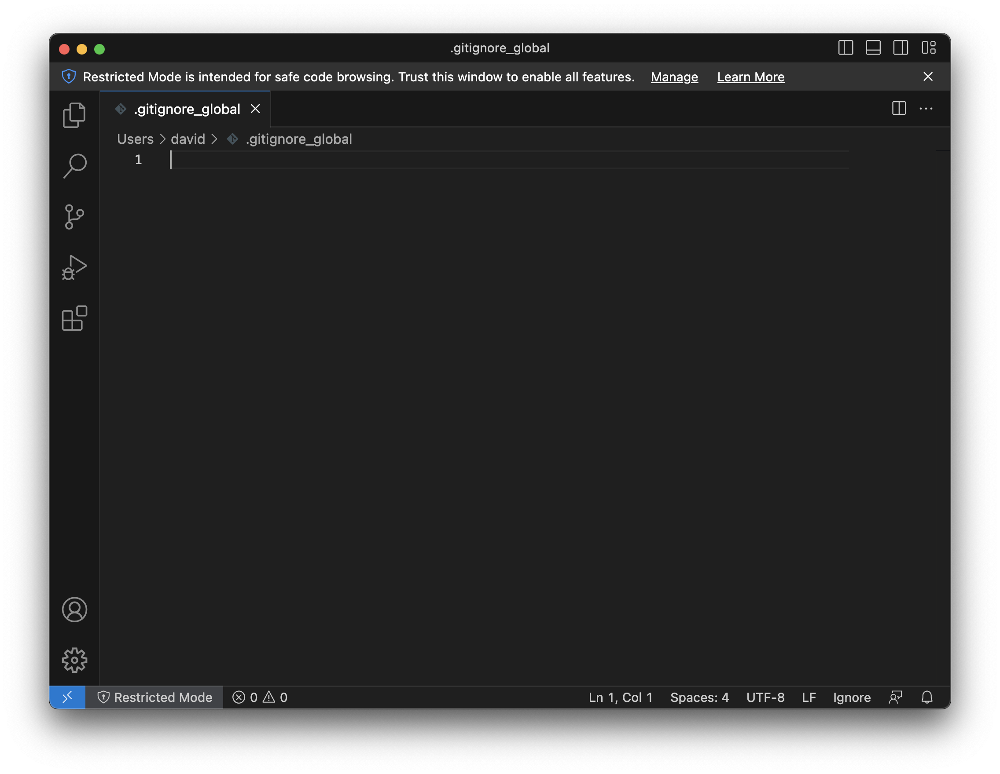

Here, you see the new **`.gitignore_global`** file open in VS Code. Note the **WSL** icon in the lower-left corner.

### Here is a [.gitignore_global file for you to use](./1.1.1-gitignore-global.md).

Open the above page and copy the contents of the code block from the page with the copy button. Note that you will need to be logged in to you GHE account to access this page!

Return to VS Code, then click inside the editor (the main portion of the VS Code window).

Paste the contents of the file you copied into the editor in VS Code. Doing this should result in your VS Code window looking similar to this:

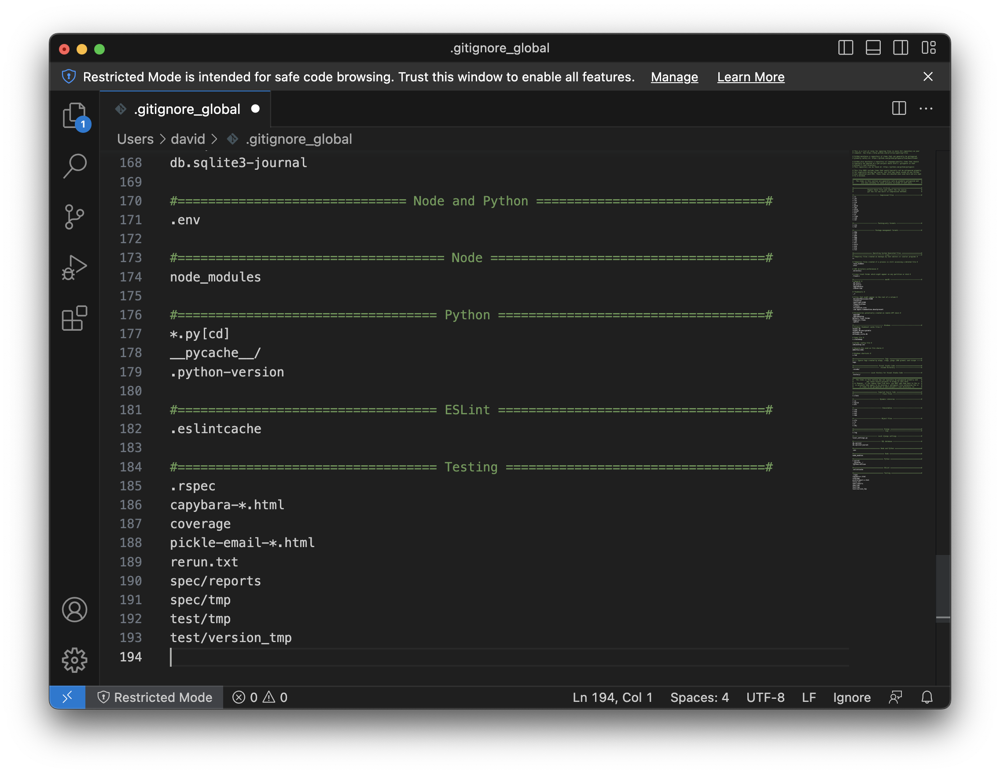

Congrats, you just edited your first file in VS Code! This is a great time to turn on **Auto Save**! The **Auto Save** setting is in the **File** menu - select it, then re-open the **File** menu to ensure that there is a checkmark next to the **Auto Save** option, as shown below.

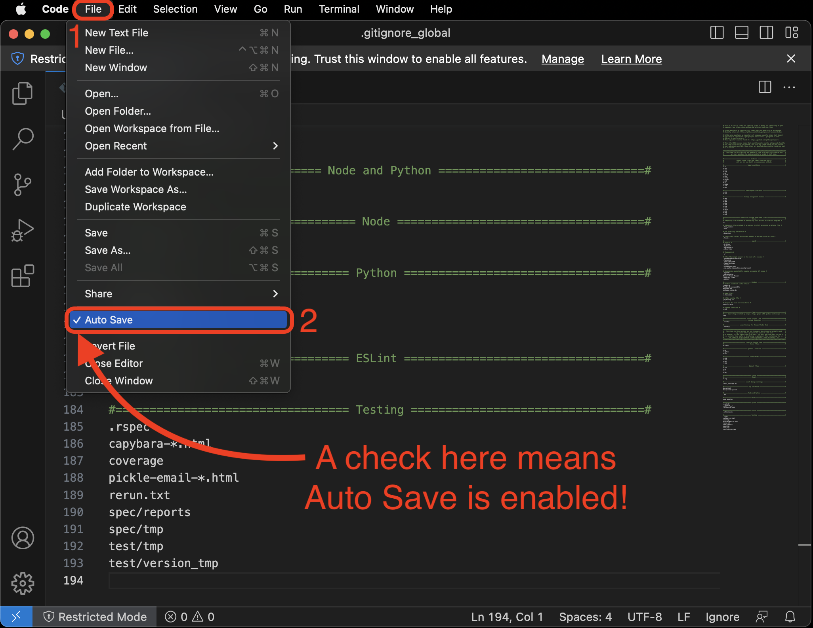

This should save the file, but let's be sure by manually saving it by using **Save** in the **File** Menu or pressing **`⌃ Ctrl + S`**.

You can close VS Code for now.

# Node.js

Use this command to install `nvm`, which we will use to install Node.js. `nvm` stands for [Node Version Manager](https://github.com/nvm-sh/nvm) and can be used to swap between different versions of Node.js quickly. We won't swap between different versions in the course, but it's still a handy tool for managing our Node.js install and can help you manage your Node.js installation post-course. Get `nvm` with this command:

```bash
curl -o- https://raw.githubusercontent.com/nvm-sh/nvm/v0.39.4/install.sh | bash
```

You may see this prompt part way through the install process:

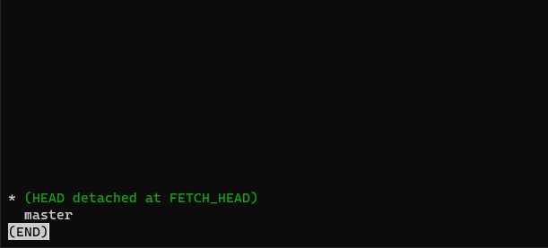

If you do, just hit **`q`** - that will exit this screen and return you to the below install process. If you don't get this error, that's great; continue until you see the completed installation of `nvm`:


**Restart the Terminal application now.**

After starting up the Terminal again, run this command to check the version of `nvm`: 

```bash
nvm --version 
```

If you do not get a version number, check out the **Handling errors üíî** subsection below; otherwise, continue.

Use nvm to install node version 18 with this command:

```bash
nvm install 18
```

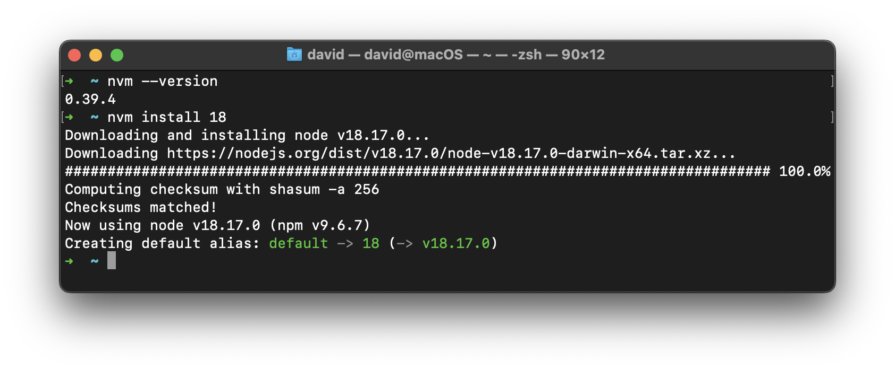

A successful install of node v18.17.0.

## Handling errors üíî

### command not found: nvm error

Copy this command block and run it in the terminal, which will point to the nvm directory in your **`~/.zshrc`** file:

```bash
cat << EOF >> ~/.zshrc

export NVM_DIR="$HOME/.nvm"
[ -s "$NVM_DIR/nvm.sh" ] && \\. "$NVM_DIR/nvm.sh"  # This loads nvm
[ -s "$NVM_DIR/bash_completion" ] && \\. "$NVM_DIR/bash_completion"  # This loads nvm bash_completion
EOF

```

Restart your terminal. You should now be able to run the `nvm --version` command and get a version number in response. If you do not, alert your installfest point of contact.

## NPM config

Run this command to disable `npm` update notifications since this process is managed by `nvm`:

```bash
npm config set update-notifier false
```

There will be no output after running this command.

## nodemon

With Node.js installed, install `nodemon` globally with this command:

```bash
npm i -g nodemon
```

If nodemon has successfully installed, this should be the output:

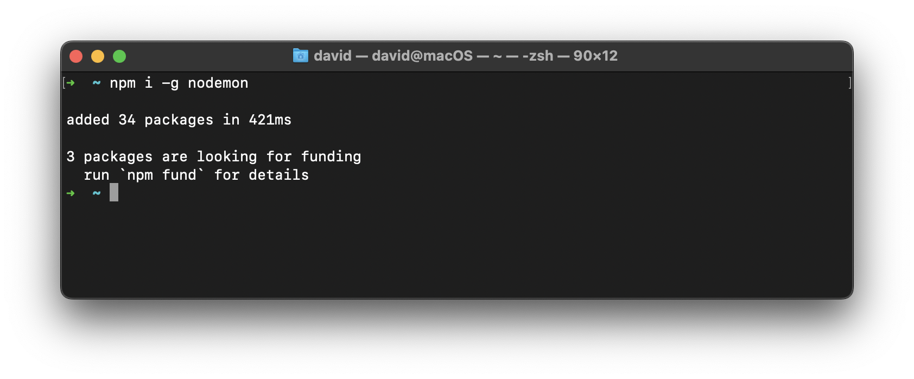

## `~/code` directory

You'll need somewhere on your computer to put all of your work in the course - that's what the `~/code` directory will be for you! All course content assumes you will have this directory, so let's create it now with this command in your terminal:

```bash
mkdir ~/code
```

# OH WOW YOU DID IT!

You are now set up to start developing in macOS! Be very proud of yourself; that was quite the process!

