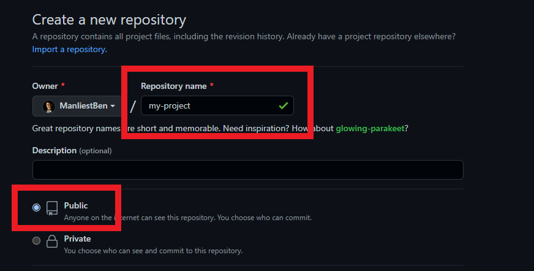

# GitHub Introduction


## GitHub or Git? 🤨

GitHub is not the same as Git. 

GitHub is a social network **built around** Git. It has completely changed the way we, as programmers, share and work on code. GitHub is **the most prominent online storage space of collaborative work**, and it utilizes Git to keep track of versions, issues, and requests for changes.

GitHub also plays the critical role of a cloud-based backup system - **a safe place for all your work!** Your code, and the time you spent writing it, are valuable;  you don't want to risk losing it to hardware failure, etc. So, we connect our local Git repo to a remote repo on GitHub that we can then push code to and pull code from on-demand.


**In summary:**

- Git provides us with **local** repositories **on our computers** 💻
- GitHub provides us with **remote** repositories stored **in the cloud** ☁️

GitHub is a crucial part of what is known as "open source" coding, where developers from all over are able to work together to build something. It is something that you will be using extensively in your Software Engineering journey, long after this class ends.

During your time here at GA, you will be making use of two GitHub accounts. One will be your **ENTERPRISE** GitHub account, which will contain all of your resources and work for this cohort. The second will be your **PERSONAL** GitHub account, for your assigned and future projects that you will be showcasing.


If you have not signed up for your GA **Enterprise** GitHub account yet, here's the link to do so: [https://git-invite.generalassemb.ly](http://git-invite.generalassemb.ly)

If you have not signed up for your Personal GitHub account yet, you may do so [HERE](https://github.com/) on GitHub's website.

&nbsp;

## ***Let's take a look below at some of the common actions you will be performing with GitHub throughout this cohort and your career:*** 👀 👇

🚨 ***Don't ever make changes to your code on **github.com** until you feel extremely comfortable with these Git concepts.***

&nbsp;

## **Creating a new repository on GitHub:**

### When to create a remote repo on GitHub:

- Any exercise that asks you to create a new repository for a deliverable.
- Any code you write that didn’t originate from a template we’ve given you.

### When you should **NOT** create a remote repo on GitHub:

- Any exercises/deliverables where forking/cloning is mentioned in the instructions.
- Applications/projects/deliverables that require beginning with a template repository containing starter code.

***Before you can push code to GitHub, you must link a LOCAL git repository with a GitHub repository.***

There will be two options below, based on whether you currently have a local directory or not. If you need to start from scratch and create a new directory, use ***OPTION 1***. If you already have a directory with your code base started, use ***OPTION 2***.

### ***OPTION 1*** (＃☝️):  A fresh, new directory on my machine

If the directory does not yet exist on your machine, create the directory locally, wherever you’d like.  For example:

```
cd ~/code/sei
mkdir my-project
cd my-project
```

Then run the following command to initialize the directory:
```
git init
```
After running that command:

1. You should see the `main` branch indicated in the terminal because of the way we’ve configured zsh:


**OR**

2. You should see a `.git` directory if you check a detailed list of ALL the contents of the directory by typing `ls -a`:


<br>

Next, it's time to create a new repository on GitHub.


<br>

Be sure that you select an appropriate name for the repository, and if you plan on sharing it with the instructional team, be sure that it is public:



<br>

Be sure that **NONE** of the following options are selected.  (There’s a time and place to use these options, hold off while you’re learning the ropes!):


<br>

When you’ve entered these items, click on ‘Create repository.’


<br>

The next screen will give you a URL that we’ll use to connect your local repository to the repository that you just created on GitHub.  Click on the button to copy the URL to the clipboard:


<br>

Now all that's left to do is add the remote url to our local git repository.

Inside of the directory that you initialized as a local git repo, add the URL pointing to the GitHub repository with the following command:

```
git remote add origin https://github.com/<your-GH-username>/my-project.git
```

***Your link should look different than this, as it will have your GitHub username & project name in it!***

❗️ ***We’re using `origin` as the name of the remote here, but you could use anything. This is what you’ll most often see as the default remote for a project, and will use this for about 90% of what we do in this course.***

Once you’ve completed the steps to link your local git repository with the GitHub repository, you can **push** your code using the following commands:

```
git add .
git commit -m 'initial commit'
git push origin main
```


## ***OPTION 2*** (＃✌️): Code that already exists on my machine

Navigate to the root level of the directory you’d like to set up as a repository:

```
cd ~/code/sei/my-project
```

In order for this existing local directory to be linked to your remote GitHub repository, your existing local directory must be initialized as a git repository.

Not sure if your directory is initialized? Here's how to check:
If the directory has been initialized as a git repo, two things should be true:

1.  You should see the `main` branch indicated in the terminal because of the way we’ve configured zsh:


**OR**

2. You should see a `.git` directory if you check a detailed list of ALL the contents of the directory by typing `ls -a`:


If neither of the above appear, your directory has not been initialized and you will need to do so now. While in the directory you would like to initialize as a repo, run the following command:

```
git init
```

If your directory was, in fact, already initialized, now it's time to create a new repository on GitHub and link it to your local repository using the following steps:


Be sure that you select an appropriate name for the repository, and if you plan on sharing it with the instructional team, be sure that it is public:


Be sure that **NONE** of the following options are selected.  (There’s a time and place to use these options, hold off while you’re learning the ropes!):


When you’ve entered these items, click on ‘Create repository.’


The next screen will give you a URL that we’ll use as a remote to connect your local repository to the repository that you just created in GitHub.  Click on the button to copy the URL to the clipboard:


Now all that's left to do is add the remote url to our local git repository to link the two.

Inside of the directory that you initialized as a local git repo, add the URL pointing to the GitHub repository:

```
git remote add origin https://github.com/<your-GH-username>/my-project.git
```

***Your link should look different than this, as it will have your GitHub username & project name in it!***

❗️ ***We’re using `origin` as the name of the remote here, but you could use anything.  This is what you’ll most often see as the default remote for a project, and will use this for about 90% of what we do in this course.***

Once you’ve completed the steps to link the local git repository with the GitHub repository, you can push your code using the following commands:

```
git add .
git commit -m 'initial commit'
git push origin main
```

As you work on larger and larger projects, you will see your Commit history grow. This is a great way to track who on your team has made changes to what parts of which files, and when they were made. It can be especially useful when there is a conflict or bug in the code, so that you can see exactly where the error has been made and fix it easily.


## **Forking**


**What it does:**

*Forking* a repository copies the entire contents of a repository on an individual's GitHub account (someone else's) to another GitHub account (yours).

**When and why we use it:**

To make a copy of an entire repository that can then be changed without impacting the original repository. 

There are two big use cases for forking that you'll encounter during the course. If there's a lab requiring you to fill in coding challenges/exercises and submit a link with your solutions, you'll start by forking the class repository to your personal GitHub account. You'll then complete the exercises, push the updated changes to your personal GitHub account, then submit a link to your instructors. 

You'll also use forking when working in groups, but we'll cover that later.


📚 ***A fork is a copy of a remote repository made by a developer, allowing them to experiment with, modify, or contribute to the original project without affecting the original codebase.***

Fork is also used as a verb, for example: ***Go fork this repo.***

## Forking a repository to your personal GitHub

Navigate to the repository you’d like to fork on GitHub.  Click on the ‘Fork’ button in the upper right portion of the screen:


<br>

On the next screen, you should verify that the Owner is your personal GitHub account and that the repository name is correct.  Both of these values should be correct when automatically populated, but double-checking is always a good idea. If everything looks right, click the ‘Create fork’ button.


<br>

You’ll see a brief screen indicating that the repository is being forked to your personal GitHub.


<br>

Once this is complete, you’ll be redirected to your GitHub account where the fork was created.  Click on the ‘Code’ button to display a URL, which we’ll copy to the clipboard:


Once you've completed the steps above, you will now have a forked copy of the GitHub repo. In order to get a copy as a local repository on your machine, follow the steps below to clone that repo. 👇

&nbsp;

## **Cloning:** `git clone`


**What it does:**

*Cloning* allows us to take the current state of a project from a remote repository on GitHub and make a copy onto a local repository on your computer.

**When and why we use it:**

To copy a remote repository to our local machine.

You'll use this command anytime you want to make a copy of a project that already exists on GitHub. This is typically the next action you'll take after you fork an existing repository so that you're able to work on it on your local machine.

Step 1: Navigate to the parent directory where you want the cloned directory to exist:

```
cd code/sei
```

🚨 ***When you clone a repository, a directory (matching the repository’s name) will be created automatically.  It’s important that you don’t create an additional directory locally, as that may cause issues/confusion later on down the road.***

Step 2:  Using the URL from GitHub, clone the repository

```
git clone https://github.com/<original author>/my-project.git
```

Your link should look different than this, as it will have your GitHub username & project name in it!

🚨 ***When you clone a repository, an origin remote will automatically be set using the URL that you used to clone it.  If you’ve cloned a repository that you don’t own (or have write access to), you won’t be able to push changes!***

Step 3:  Navigate into the directory and open in VS Code

```
cd my-project
code .
```

Once you’ve completed the above steps to clone the repository to your machine, you can push changes made to your code using the following commands:

```
git add .
git commit -m 'a meaningful, concise commit message here'
git push origin main
```


&nbsp;

## **Viewing Remotes:** `git remote -v`

**What it does:**

This command lists all of the remotes that have been configured for a local repository.

**When and why we use it:**

When you push/pull code to/from GitHub, you can select which remote you'd like to use. This command helps you identify which remotes are available.

**Examples:**

If you're following a class code-along, you might have an `upstream` remote with a link to the class repository that the instructor is pushing code to regularly so that you're able to pull changes to your local machine.

You might also have an `origin` remote with a link to your personal repository so that you can push your code to your own GitHub account as well.

Use this command when you want to see all the remotes for a given repository.

&nbsp;

*A local repository is **linked** to a remote repository by adding a remote with this command:*

```
git remote add <name of remote to be added> <URL of repo on GitHub>
```

&nbsp;

*A local repository is **"unlinked"** from a remote repository by removing it with this command:*

```
git remote remove <name of remote to be removed>
```

&nbsp;

## **Fetching:** `git pull <remote-name> <remote-branch-name>`

**What it does:**

Fetches any existing updates from a remote repository and merges them into our existing local repo.

**Why we use it:**

To bring code changes to our local machines so that we're able to have the most up-to-date version of our code.

**When we use it:**

When we want to be in-sync with the remote repository that we are pulling from.

&nbsp;

## **Pushing:** `git push <remote-name> <remote-branch-name>`

**What it does:**

This command sends all of the files/directories that have been added/changed since the last commit to a repository online.

**When and why we use it:**

Do this immediately after you do `git add .` and `git commit -m "Your commit message"`. To get your code on GitHub, you push it from a local repository up to a repository in the cloud (online).

&nbsp;

♻️ ***Repeatable Pattern: When working alone, the typical workflow as you’re working on code will be:***

*-make changes to code-*
```        
git add .
git commit -m “message describing code changes”
git push origin main
```
*-repeat-*

*For the purposes of this course you will almost always run these 3 commands together.*

&nbsp;

## 🟩 Why Green? 

As a student, you're on a whirlwind journey to jump start your tech career. Making a good impression is key! You've probably heard about 'green squares' on GitHub and might be wondering, "Why should I care?"

Your GitHub profile will show a calendar depicting your repository contributions over the past year. This is visualized with the use of green squares - the darker the green, the higher the commits on that day.

The contribution calendar is a quick, at-a-glance way for people visiting your GitHub profile to see how active and consistent you are with committing code. 

So, let's cover the good (and less good) reasons to care about green squares:

#### The good reasons:

**Proof of Practice**: Think of the green squares as a diary of your coding journey. Every time you code and push your work to GitHub, you're not only saving your progress but also showcasing your dedication. It’s like a gym membership card with stamps for every day you worked out!

**Portfolio in Progress**: When potential employers or mentors look at your GitHub profile, they're not looking for expertise—they're looking for growth. Those green squares, alongside the projects you're working on, tell a story of your evolution as a developer.

#### The less good reasons:

**Overemphasis on Visibility**: New engineers might feel that unless they are consistently visible on platforms like GitHub, they are falling behind, even though growth as an engineer involves many aspects, including reading, learning, discussing, and sometimes even disconnecting.

**Burnout**: The pressure to maintain a "streak" or keep green squares consistent can lead to burnout, especially if the engineer feels compelled to work even when they should take breaks.

<hr>

While the green squares are great, they're not the sole metric of your abilities or worth. It's the quality of your contributions, the complexity of the projects, and your understanding of the code that truly matters. It's okay to have days without green squares. Burnout is real. So, while you chase those green badges of honor, don’t forget to balance work, rest, and a holistic learning approach. 

For a more in-depth dive into how daily commits are calculated, check out the [Contributions Calendar Docs](https://docs.github.com/en/account-and-profile/setting-up-and-managing-your-github-profile/managing-contribution-settings-on-your-profile/viewing-contributions-on-your-profile#contributions-calendar). 

## Capture your Lab contributions:

One thing which will make it easier to kickstart an impressive contribution calendar is to get 'credit' for all of your daily lab commits throughout this course. By default, commits you make to your Enterprise account will not show up on your personal account. 

The following instructions will guide you through connecting a lab to a new (personal) GitHub repository: 

1. **Signing into GitHub**:
   - First, visit [github.com](https://github.com/login).
   - Sign in using your credentials.

2. **Creating a New Repository**:
   - After signing in, locate the `+` icon at the top right corner of your screen.
   - From the dropdown menu, choose `create new repository`.
  
   
   
   - For the repository name, use the same name as this Lab.

3. **Connecting the New Repository**:
   - Once your repository is created, you'll need to link it with the Lab's existing repository on your computer.
   - **Note**: The existing repo on your machine will already have a remote named "origin", to add a second remote you will need to choose a new remote name.

4. **Setting up a Second Remote**:
   - We'd recommend naming this second remote "github" so it's easy to remember that you'll be pushing your work to GitHub.
   - Open your terminal or command prompt.
   - Navigate to the directory of your Lab's existing repository.
   - Add the new remote with the following command:
     ```
     git remote add github https://github.com/[your-user-name]/[new-repo-name].git
     ```
     Make sure to replace `[your-user-name]` with your GitHub username and `[new-repo-name]` with the name of the repository you just created.

5. **Pushing Your Code**:
   - Now that your new remote is set up, you can push your Lab's code to it:
     ```
     git push github main
     ```

     You can also use the following command to push your code to all remotes (github and github enterprise) at once:
     ```
     git push all main
     ```


# Wrap up

This is just the most basic GitHub workflow. Of course, things get even more complex when you start sharing code and managing larger codebases, but you won't have to worry about that for a little while.

This was a lot of info! If you're feeling a bit intimidated by the vocabulary and workflow right now, don't worry, this is something you'll get tons and tons of practice in (you'll likely use GitHub every single day for the next 90 days) 

Here is a [**Cheat Sheet**](https://training.github.com/downloads/github-git-cheat-sheet.pdf) from GitHub for your convenience.

Also, here is a [**LINK**](../1.1-cli-intro-main/cheatsheets/additional-cli-cheatsheet.md#git-commands) to some GitHub commands that are included in our CLI Cheat Sheet.

Remember, Git and GitHub are difficult! Most large companies will have a team dedicated solely to git issues across their dev teams because of how common they are.


